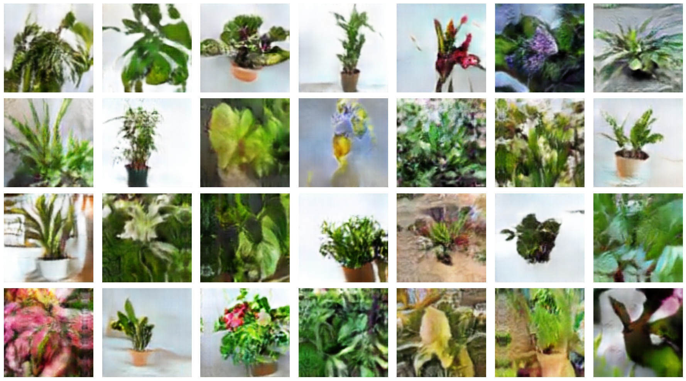

# Deep Convolutional GAN generating houseplants

This project generates 96*96 houseplant images

The model is a 15M parameters DC GAN trained ~10hours on a T4 GPU and it features :
- Minibatch discrimination
- Data augmentation
- Custom training loop
- Replay buffering

Tips that helped me train the (very capricious and unstable) generator:
- label smoothing
- training the gen 3-5 times for each discriminator update
- having the discriminator accuracy around 70%

### Results

### Latent space interpolations

